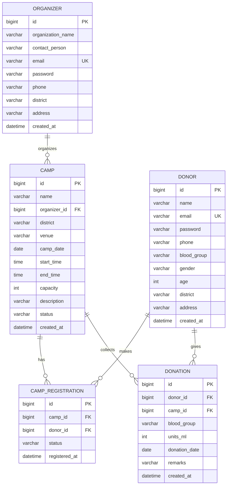

# Jeevadaana — Database Design & ER Diagram

## Entities

| Entity | Description |
|--------|-------------|
| **Donor** | A person who registers to donate blood. |
| **Organizer** | An organization/NGO/hospital that organizes donation camps. |
| **Camp** | A blood donation camp organized by an Organizer in a district. |
| **CampRegistration** | A donor signing up for a particular camp (many-to-many link). |
| **Donation** | A blood donation record created during post-camp management. |

## Relationships

- **Organizer (1) — (N) Camp** : one organizer organizes many camps.
- **Camp (1) — (N) CampRegistration (N) — (1) Donor** : a donor registers for many camps and a camp has many registered donors (resolved via the `camp_registrations` junction table, unique on `(camp_id, donor_id)`).
- **Donor (1) — (N) Donation** : a donor has a donation history.
- **Camp (1) — (N) Donation** : donations are collected at a camp.

## ER Diagram

## Enumerations

- **BloodGroup**: `A+, A-, B+, B-, AB+, AB-, O+, O-`
- **Gender**: `MALE, FEMALE, OTHER`
- **CampStatus**: `UPCOMING, COMPLETED, CANCELLED`
- **RegistrationStatus**: `REGISTERED, ATTENDED, CANCELLED`
