# Jeevadaana — Final Verification Test Report

**System:** Jeevadaana — Blood Donation Management System
**Stack:** Spring Boot 3.3 (Java 17) · Spring Data JPA · MySQL 8 · Thymeleaf + Bootstrap 5 · Maven
**Branch verified:** `main` (after merge of PR #1, #2, #3 — commit `ff2e927`)
**Environment:** Local Spring Boot app on `:8080` connected to MySQL `jeevadaana` database
**Date:** 2026-06-07

## Summary

All requested modules were verified **end-to-end against a live MySQL database** (no mock
data). The database was dropped, recreated and re-seeded before testing, then every
user-facing write was cross-checked with a MySQL `SELECT` and, where applicable, the REST
JSON API. **15/15 checks passed**, no console errors.

| # | Module / Requirement | Result | Evidence |
|---|----------------------|--------|----------|
| 1 | Donor instructions + eligibility guidelines page | PASS | `02-donor-guidelines.png` |
| 2 | Organizer instructions page | PASS | `03-organizer-info.png` |
| 3 | Donor registration stores in MySQL + Registration ID shown | PASS | `04-donor-reg-success.png` |
| 4 | Donor login + Registration ID on dashboard | PASS | `05-donor-dashboard.png` |
| 5 | Camp registration + duplicate prevention | PASS | `06-camp-registration.png` |
| 6 | Nearby / district-wise camp search (REST) | PASS | `07-district-search.png` |
| 7 | Organizer registration stores in MySQL + Organizer ID shown | PASS | `08-organizer-reg-success.png` |
| 8 | Organizer dashboard + aggregate statistics | PASS | `09-organizer-dashboard.png` |
| 9 | Post-camp statistics (totals + blood-group-wise) | PASS | `10-postcamp-stats.png` |
| 10 | Donation history / previous donations | PASS | `11-donation-history.png` |
| 11 | Camp detail — current camp information (REST) | PASS | `14-camp-detail.png` |
| 12 | Success messages across forms | PASS | banners in 04/06/10 |
| 13 | Responsive UI (mobile viewport) | PASS | `12-responsive-mobile.png`, `13-responsive-menu.png` |
| 14 | Data persisted & retrieved from MySQL (every action) | PASS | SQL output below |
| 15 | No console / runtime errors | PASS | console empty |

---

## Test data created during verification

| Entity | Value |
|--------|-------|
| New donor | Meera Verification · `meera.verify@example.com` · B- · Bengaluru → **DNR-000002** |
| New organizer | LifeFlow Foundation · `lifeflow.verify@example.com` · Mysuru → **ORG-000002** |
| Camp registration | Meera → City Blood Drive (`camp_registrations` row) |
| Donation | Meera, City Blood Drive, 450 ml, remark "Smooth donation" |

Final row counts in MySQL after the run:

```
donors              2
organizers          2
camps               3
camp_registrations  1
donations           1
```

---

## Detailed results

### 1. Donor instructions & eligibility (`/guidelines`)
Renders blood-donation instructions and donor eligibility (18–65 yrs, ≥50 kg, ≥12.5 g/dL
haemoglobin, 3-month gap, etc.).

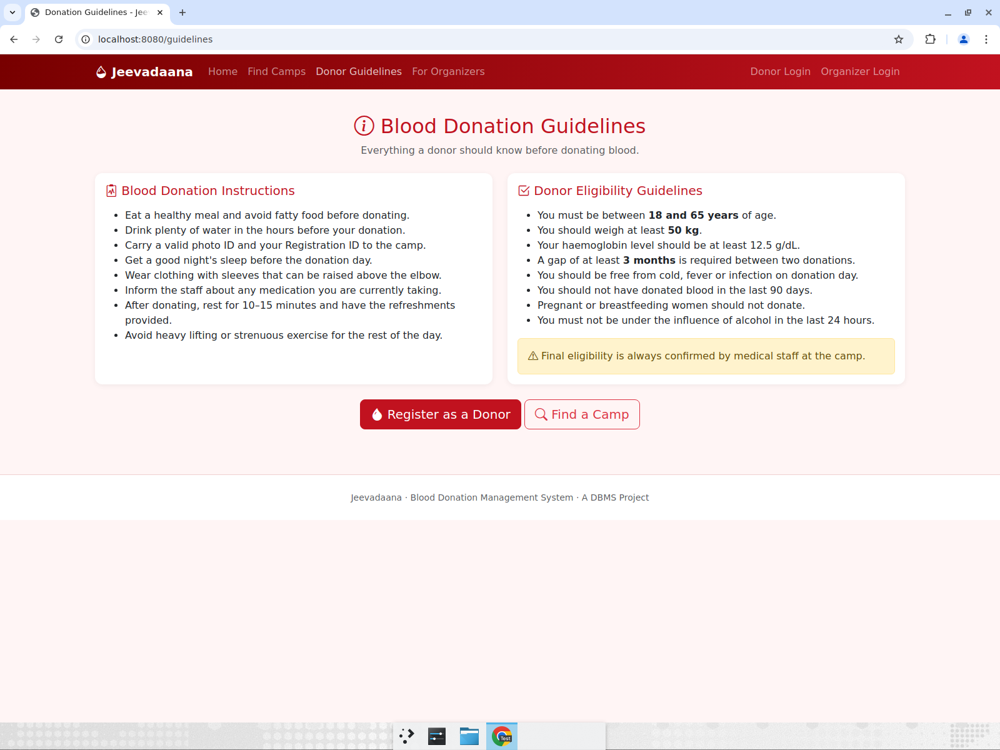

### 2. Organizer instructions (`/organizer-info`)
Renders "Getting Started" and "Managing & Post-Camp" instructions.

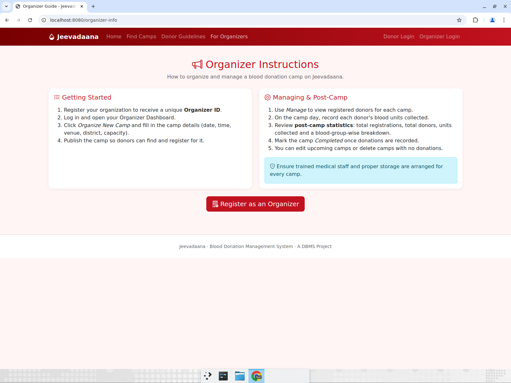

### 3. Donor registration → MySQL + auto Registration ID
Submitting the donor form shows the success banner with the auto-generated
**Registration ID DNR-000002** and persists the row.

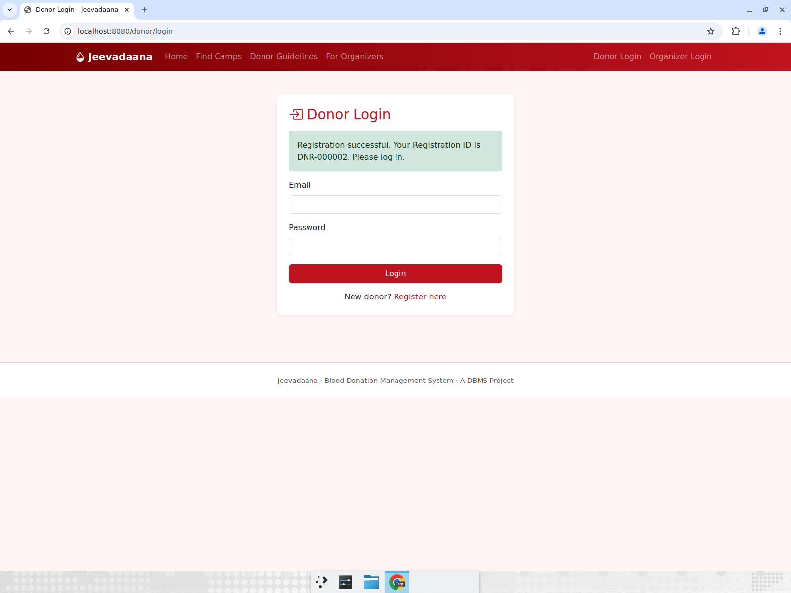

```sql
SELECT id,registration_code,name,email,blood_group,gender,age,district
FROM donors WHERE email='meera.verify@example.com';
-- 2 | DNR-000002 | Meera Verification | meera.verify@example.com | B_NEGATIVE | FEMALE | 30 | Bengaluru
```

### 4. Donor login + dashboard
Login works; dashboard shows **Registration ID DNR-000002**, blood group / district,
stats cards, and **district-filtered nearby camps** (2 Bengaluru camps, Mysuru excluded).

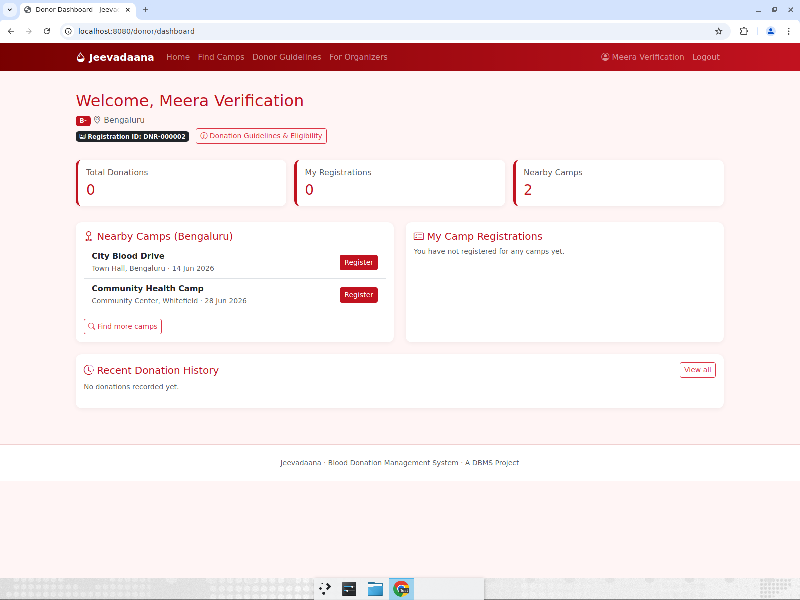

### 5. Camp registration + duplicate prevention
Registering shows "You are registered for City Blood Drive.", increments
*My Registrations* to 1 and writes a row. Duplicates are blocked by a unique key on
`(camp_id, donor_id)` and the UI replaces the button with a "Registered" badge.

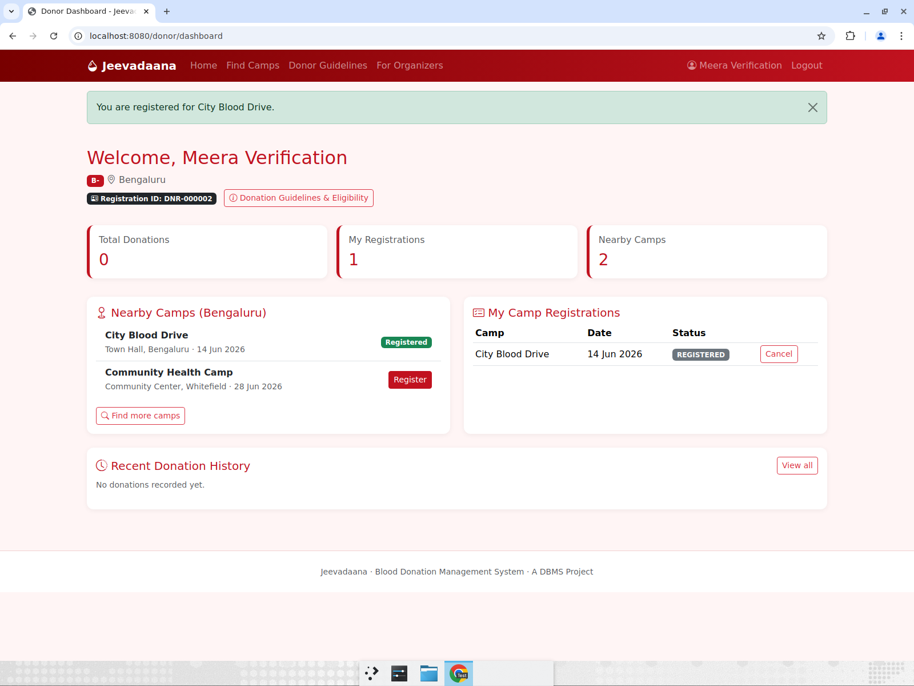

```sql
SELECT id,camp_id,donor_id,status FROM camp_registrations WHERE donor_id=2;
-- 1 | 1 | 2 | REGISTERED
-- UNIQUE KEY (camp_id, donor_id) enforces duplicate prevention
```

### 6. District-wise camp search (REST-backed)
On `/camps`, typing "Mysuru" narrows the list live from 3 → 1 via the REST API.

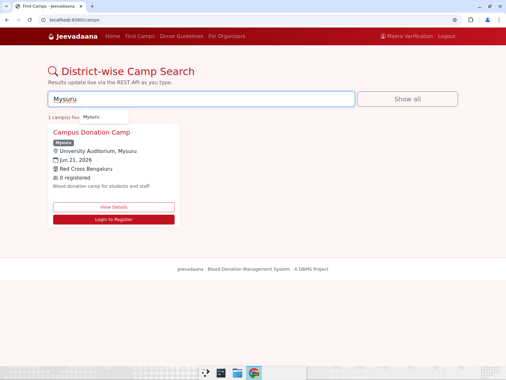

```
GET /api/camps?district=Mysuru
[{"id":2,"name":"Campus Donation Camp","district":"Mysuru", ... }]
```

### 7. Organizer registration → MySQL + auto Organizer ID
Shows success banner with **Organizer ID ORG-000002** and persists the row.

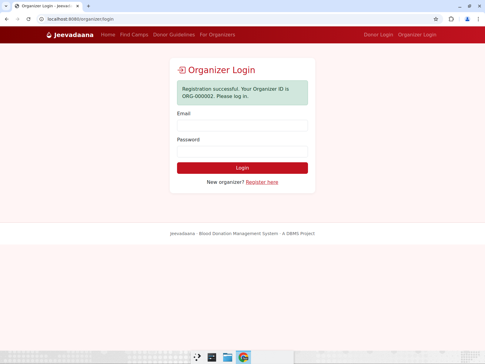

```sql
SELECT id,organizer_code,organization_name,email,district
FROM organizers WHERE email='lifeflow.verify@example.com';
-- 2 | ORG-000002 | LifeFlow Foundation | lifeflow.verify@example.com | Mysuru
```

### 8. Organizer dashboard + aggregate statistics
Shows Organizer ID ORG-000001 and aggregates across all the organizer's camps
(Total Camps 3, Upcoming 3, Completed 0, Total Registrations 1, Total Donors, Blood Units)
plus the "My Camps" table with Manage / Edit actions.

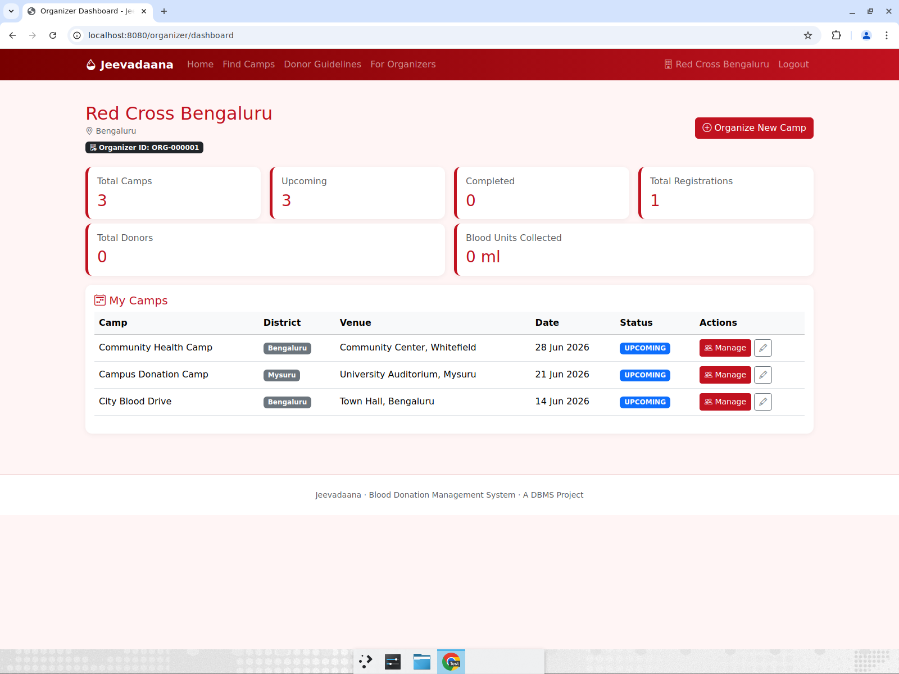

### 9. Post-camp statistics (totals + blood-group-wise)
After recording a 450 ml donation for Meera, the post-camp card updates **live**:
Total Donors 1, Blood Units Collected 450 ml, 1 blood group, and a blood-group-wise
table (B- → 1 donor, 450 ml). Donor status flips to ATTENDED / Recorded.

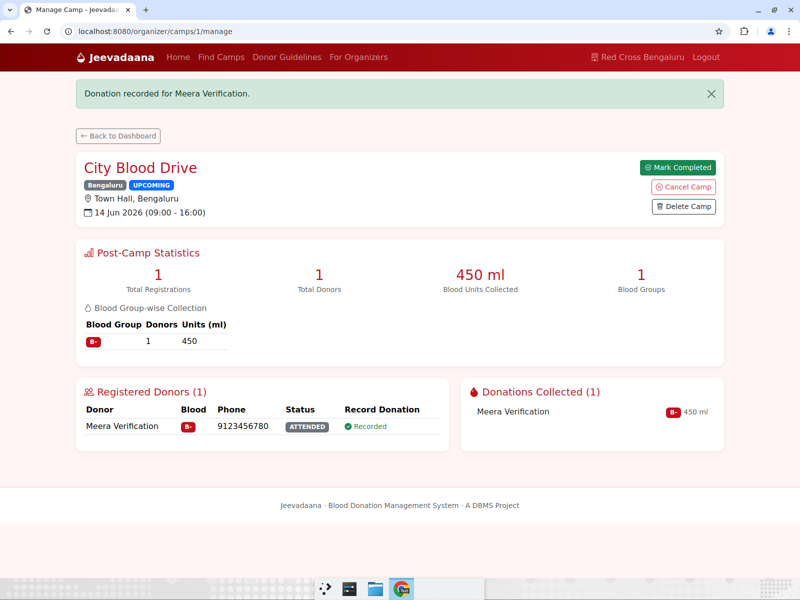

```sql
SELECT id,camp_id,donor_id,units_ml,remarks FROM donations;
-- 1 | 1 | 2 | 450 | Smooth donation
```
```
GET /api/camps/1/stats
{"totalRegistrations":1,"totalDonors":1,"totalUnits":450,
 "byBloodGroup":[{"bloodGroup":"B-","donors":1,"units":450}]}
```

### 10. Donation history / previous donations
The donor's dashboard (Total Donations 1) and the full Donation History page list the
persisted donation (14 Jun 2026, City Blood Drive, Bengaluru, B-, 450 ml, "Smooth donation").

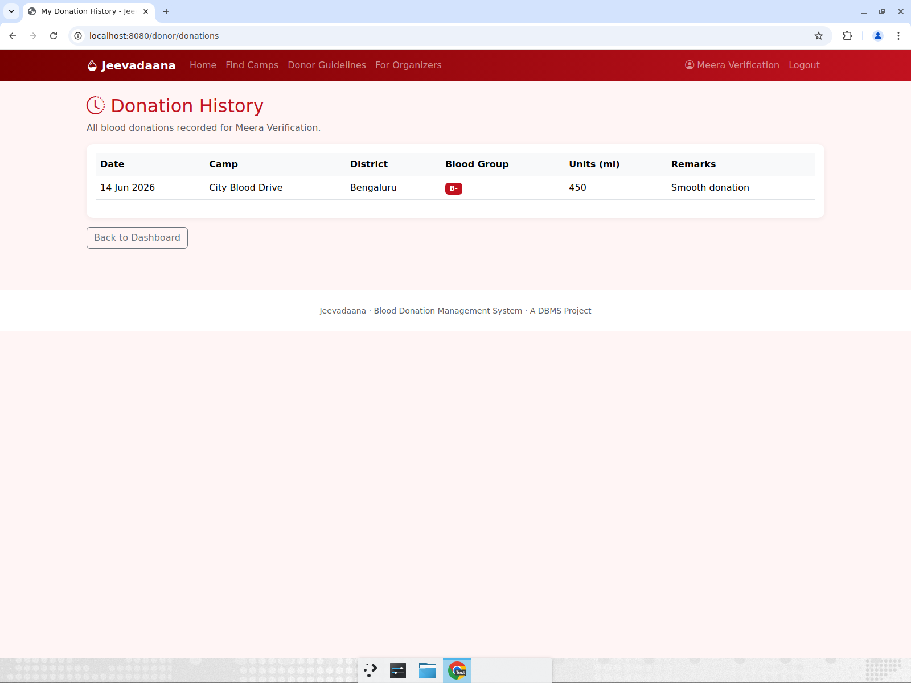

### 11. Camp detail — current camp information (REST)
`/camps/{id}` loads via `GET /api/camps/{id}` and shows date, time, venue/location,
district, registrations (1/100), organizer, contact person, phone and email.

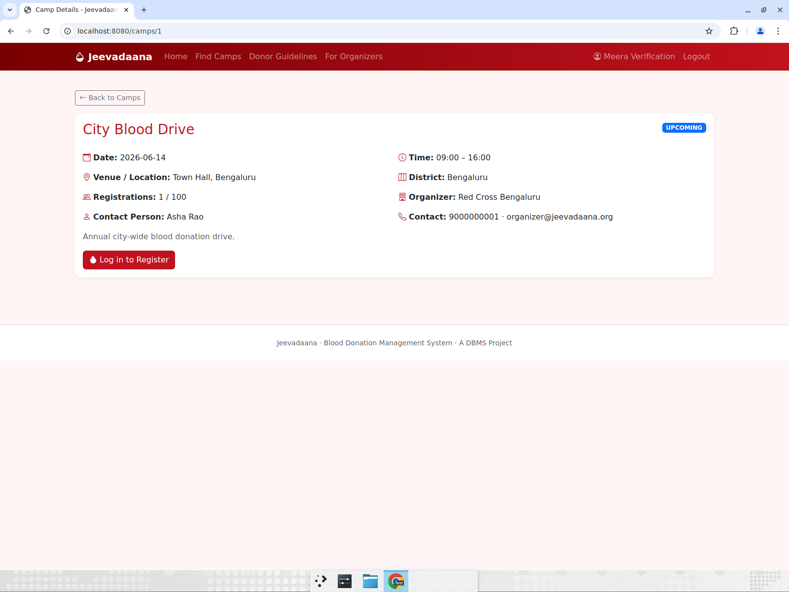

### 12. Success messages
Verified success flash banners on donor registration, camp registration and donation
recording (see screenshots 04, 06, 10).

### 13. Responsive UI (mobile viewport)
At a 400 px viewport the navbar collapses to a hamburger that expands to a full mobile
menu, and the hero / cards stack vertically.

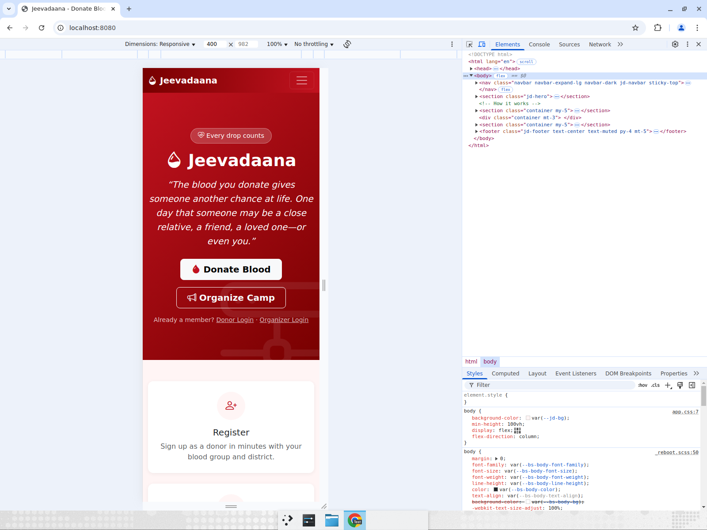
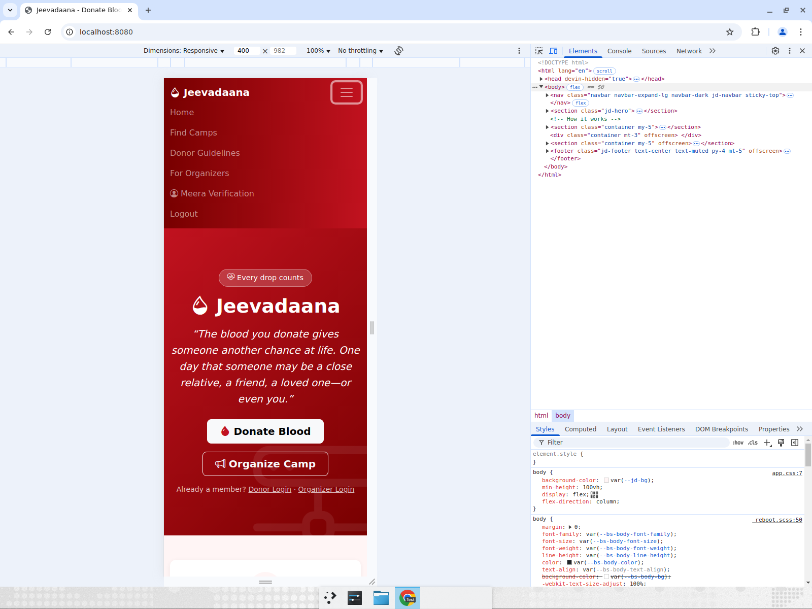

---

## Method / reproducibility

1. `git checkout main && git pull` (commit `ff2e927`).
2. `DROP DATABASE jeevadaana; CREATE DATABASE jeevadaana;` then `mvn clean package`.
3. `java -jar target/jeevadaana.jar` — `DataSeeder` seeds 1 organizer + 3 camps on boot.
4. Exercised every module in Chrome; after each write ran a MySQL `SELECT` and/or the
   REST endpoint to confirm persistence and retrieval.

**Seeded logins:** donor `donor@jeevadaana.org` / `password` · organizer
`organizer@jeevadaana.org` / `password`.

## Conclusion

Every listed module functions correctly and all user input is persisted to and retrieved
from MySQL. No defects were found.
